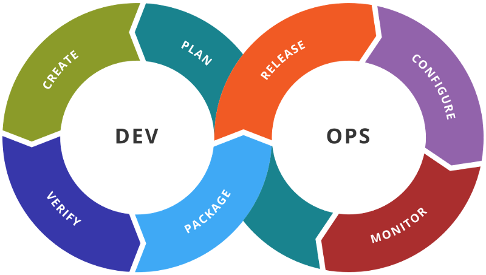

# DevOps/SRE: Learning Guide

This is a collection of a few topics and links I've found helpful in my own journey in the DevOps/SRE space.

## What is DevOps?
*DevOps* is a methodology that is a fusion of the traditional "developer" and "operator" roles.

**Books to read**
- [The Phoenix Project](https://www.amazon.com.au/Phoenix-Project-DevOps-Helping-Business-ebook/dp/B078Y98RG8)
  - The industry favourite! Fantastic fictional learning story on how a person stepped up to implement DevOps in their struggling organisation.
- [The DevOps Handbook](https://www.amazon.com.au/DevOps-Handbook-World-Class-Reliability-Organizations-ebook/dp/B01M9ASFQ3)
  - Same authors as above, but the lessons aren't presented in a long fictional story.
- [Site Reliability Engineering (Google)](https://landing.google.com/sre/books/)

**Helpful Links**
- [What is DevOps? - AWS](https://aws.amazon.com/devops/what-is-devops/)
- ["How To Become a DevOps Engineer In Six Months or Less" Part 1](https://medium.com/@devfire/how-to-become-a-devops-engineer-in-six-months-or-less-366097df7737), [2](https://medium.com/@devfire/how-to-become-a-devops-engineer-in-six-months-or-less-part-2-configure-a2dfc11f6f7d), [3](https://medium.com/@devfire/how-to-become-a-devops-engineer-in-six-months-or-less-part-3-version-76034885a7ab), [4](https://medium.com/@devfire/how-to-become-a-devops-engineer-in-six-months-or-less-part-4-package-47677ca2f058), [5](https://medium.com/@devfire/how-to-become-a-devops-engineer-in-six-months-or-less-part-5-deploy-83e790545c23).

## DevOps Engineer vs Site Reliability Engineer?
There is some debate in the tech community whether there is such thing as a "DevOps Engineer". Many prefer to use the term "Site Reliability Engineer" (including Google), or *SRE* for short.

*What should I call myself?* The one that gets you paid the most... I call myself a "Solutions Architect". I've met people who've had "Lead Ninja" on their business card. This industry is full of buzzwords and what's trendy. I've found *DevOps Engineer* to be more popular with recruiters and HR staff, while *SRE* is more used by those in the know.

**Helpful Links**
- [SRE vs. DevOps: competing standards or close friends? - Google](https://cloud.google.com/blog/products/gcp/sre-vs-devops-competing-standards-or-close-friends)

## What OS should I use?
Your company/team might be orientated towards certain technologies which will effect what operating system you use. Personally I've found Unix based systems (Linux, OSX) the easiest to use for DevOps orientated work.

However, Some enterprise software will be limited to certain Operating Systems. *Microsoft Teams* and *Skype for Business* do not have official clients for Linux. Running a combo of Windows with a Linux virtual machine or the inverse will help get you over this hurdle. Or you could use OSX, which  provides flexibility in offering support for enterprise software in addition to the goodness that comes with a Unix based system.

## What should I learn?
The **[DevOps Roadmap](https://github.com/kamranahmedse/developer-roadmap#devops-roadmap)** by *kamranahmedse* is one of the best resources I've found that lists the learning path of DevOps. Below is a list of some of my favourite blogs and videos that make up a small fraction of technologies mentioned in the Roadmap.

##### Python
- [Learn Python the Hard Way](https://learnpythonthehardway.org/book/)
- [The Hitchhiker’s Guide to Python!](https://docs.python-guide.org/)

##### Version Control / Git
- [Github: Git 101](https://guides.github.com/)
- [Git Branching Strategies](https://nvie.com/posts/a-successful-git-branching-model)
- [Git Commit Messages Best Practices](https://chris.beams.io/posts/git-commit/)
- [Oh shit, git! : How to fix mistakes](http://ohshitgit.com)

##### Markdown
- [Markdown Cheatsheet](https://guides.github.com/pdfs/markdown-cheatsheet-online.pdf)

##### Docker
- [Containerization Explained](https://www.youtube.com/watch?v=0qotVMX-J5s)
- [Learn Docker in 12 Minutes](https://www.youtube.com/watch?v=YFl2mCHdv24)
- [What is a Container?](https://www.youtube.com/watch?v=EnJ7qX9fkcU)
- [How to write excellent Dockerfiles](https://rock-it.pl/how-to-write-excellent-dockerfiles/)

##### Kubernetes
- [Kubernetes Deconstructed: 1 Hour 101 learning Video](https://vimeo.com/245778144/4d1d597c5e)
- [Kubernetes in 5 mins](https://www.youtube.com/watch?v=PH-2FfFD2PU&t=5s)
- [Kubernetes vs. Docker: It's Not an Either/Or Question](https://www.youtube.com/watch?v=2vMEQ5zs1ko)
- [Kubernetes The Hard Way by Kelsey Hightower](https://github.com/kelseyhightower/kubernetes-the-hard-way)
- AWS Kubernetes Tutorials
  - [AWS Workshop for Kubernetes - 2018](https://github.com/aws-samples/aws-workshop-for-kubernetes)
  - [Amazon EKS Workshop - 2019](https://eksworkshop.com/)

##### RESTful API's
- [Best Practices for Designing a Pragmatic RESTful API](https://www.vinaysahni.com/best-practices-for-a-pragmatic-restful-api)

##### Infrastructure-as-Code
- [A Comprehensive Guide to Terraform](https://blog.gruntwork.io/a-comprehensive-guide-to-terraform-b3d32832baca)
- [AWS CloudFormation Masterclass](https://www.youtube.com/watch?v=6R44BADNJA8)
- [Deployment Scenarios with AWS CloudFormation](https://www.youtube.com/watch?v=X31kA1ANBVw)
- [Advanced Infrastructure as Code Programming on AWS](https://www.youtube.com/watch?v=EJVNuR2GRBc)
- [Deep Dive into AWS SAM](https://www.youtube.com/watch?v=CIdUU6rNdk4)

## Helpful Learning Sites

##### Online Courses
- [A Cloud Guru](https://acloud.guru/)
- [Linux Academy](https://linuxacademy.com/)

##### Technical Q & A
- [Stack Overflow](https://stackoverflow.com/)

##### Community Sites
  - [DevOps Subreddit](https://www.reddit.com/r/devops/)
  - [CS Careers Subreddit](https://www.reddit.com/r/cscareerquestions/)
  - [Hacker News](https://news.ycombinator.com/)

##### Weekly Mailing lists
- [DevOps Weekly](https://www.devopsweekly.com/)
- [O'Reilly System Engineering Newsletter](https://www.oreilly.com/webops-perf/newsletter.html)

##### Industry Engineering Blogs
- [Netflix](https://medium.com/netflix-techblog)
- [Twitter](https://blog.twitter.com/engineering/en_us.html)
- [Airbnb](https://medium.com/airbnb-engineering)
- [Github](https://githubengineering.com/)
- [Massive Industry Blog List!!!](https://github.com/sumodirjo/engineering-blogs)

##### AWS
- [This Is My Architecture](https://aws.amazon.com/this-is-my-architecture/)
  - A collection of architecture walkthrough videos by companies who have used AWS to solve a variety of problems.
- AWS Podcasts
  - [The AWS Podcast](https://aws.amazon.com/podcasts/aws-podcast/)
  - [AWS TechChat](https://aws.amazon.com/podcasts/aws-techchat/)
- [AWS Twitch Channel](https://www.twitch.tv/aws)
- [AWS Re:Invent Conference Videos](https://reinventvideos.com/)
- [AWS Samples Github](https://github.com/aws-samples)

##### Microsoft Azure
- [Azure Friday](https://channel9.msdn.com/Shows/Azure-Friday)
- [Microsoft Ignite Conference Videos](https://myignite.techcommunity.microsoft.com/videos)

## Recommended Software Tools
- Editors and IDE's
  - [Atom](https://atom.io/)
  - [Visual Studio Code](https://code.visualstudio.com/)
  - [PyCharm](https://www.jetbrains.com/pycharm/)
- Git UI Cleints
  - [Git Kraken](https://www.gitkraken.com/)
  - [Source Tree](https://www.sourcetreeapp.com/)
- Virtualisation
  - [Virtual Box](https://www.virtualbox.org/)
  - [Docker](https://www.docker.com/)
- RESTful Clients
  - [Postman](https://www.getpostman.com/)
- Team Chat Clients
  - [Slack](https://slack.com/)
  - [Microsoft Teams](https://products.office.com/en-us/microsoft-teams/group-chat-software)
- Package Managers
  - [Pip: Python Package Manager](https://packaging.python.org/tutorials/installing-packages/)
  - [Node Package Manager](https://www.npmjs.com/)
  - [Homebrew: Package Manager for OSX](https://brew.sh/)
- Regex
  - [RegExr: Regex Testing](https://regexr.com/)
